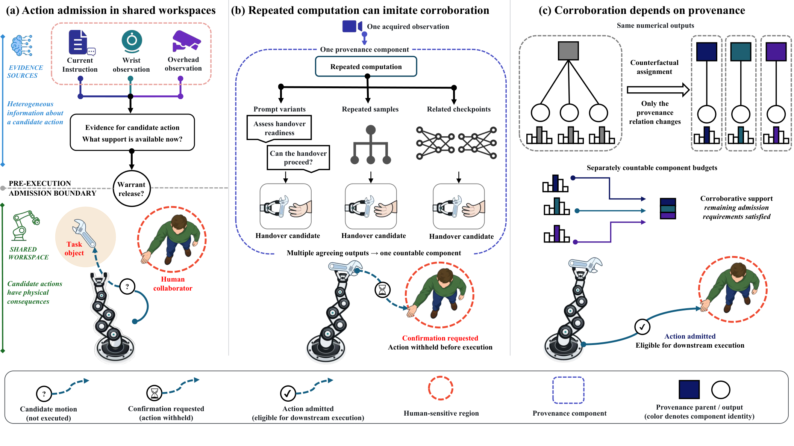
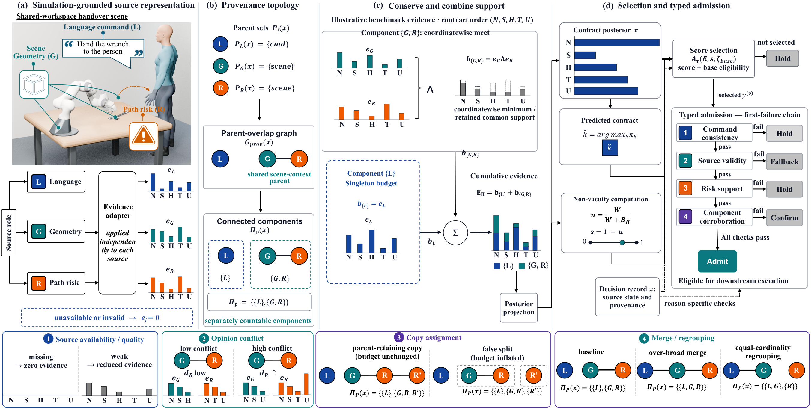

<div align="center">


# PACT

### Provenance-conserving multi-view fusion for typed action admission

Repeated inference can produce agreement without adding an observation. **PACT preserves that distinction before a robot action is admitted.**



[Paper](https://arxiv.org/abs/2609.01662) · [PDF](https://arxiv.org/pdf/2609.01662) · [Why PACT](#why-pact) · [Quick start](#quick-start) · [Method](#method) · [Results](#results) · [Run the studies](#run-the-studies) · [Citation](#citation)

[](https://arxiv.org/abs/2609.01662)
[](https://github.com/ZekaiJ/PACT/actions/workflows/tests.yml)
[](https://www.python.org/)
[](LICENSE)
[](LICENSE-DATA)

</div>

Official implementation for [**“Not All Agreement Counts as Corroboration: Provenance-Conserving Multi-View Fusion for Typed Action Admission in Human–Robot Collaboration”**](https://arxiv.org/abs/2609.01662).

Zekai Jin · Hanrong Zhang · Yihong Tang · Fei Hu · Zhen Dong · Yi Shao

## Why PACT

Multimodal models can query one scene repeatedly through prompt variation, stochastic decoding, or related checkpoints. The resulting predictions may agree, yet they can still trace back to the same observation and the same evidence-producing process. Counting each output as fresh support can therefore make an action appear better corroborated than the observations warrant.

PACT treats evidence provenance as part of the fusion problem. It groups source records that reuse a parent process, conserves their common support within each group, and accumulates support only across groups declared separately countable. Candidate ranking and action admission remain separate: a high score proposes an action, while typed checks determine whether the available evidence permits its release.

| Question | PACT's answer |
|---|---|
| When does agreement add evidence? | When support comes from separately countable provenance components. |
| What happens to repeated outputs? | Their agreement is retained inside one component without multiplying its evidence budget. |
| Does the highest-scoring action execute automatically? | No. Admission also checks command consistency, source validity, risk support, and corroboration. |
| What happens when a check fails? | The system returns a reason-specific `hold`, `confirm`, or `fallback` outcome. |

## Quick start

PACT requires Python 3.10 or later.

```bash
git clone https://github.com/ZekaiJ/PACT.git
cd PACT
python -m pip install -e .
python examples/pact_quickstart.py
```

Expected output:

```text
posterior: [0.5917, 0.1286, 0.1059, 0.0907, 0.0831]
provenance components: (('geometry', 'risk'), ('language',))
selection score: 0.7364
```

The public API exposes `SourceEvidence`, `pact_fuse`, and `pact_registered_components` from `action_admission`.

<details>
<summary>Minimal Python example</summary>

```python
import numpy as np

from action_admission import SourceEvidence, pact_fuse


def source(name, probabilities, parents):
    return SourceEvidence(
        source_id=name,
        probabilities=np.asarray(probabilities, dtype=np.float64),
        quality=0.9,
        conflict=0.0,
        missing=False,
        parents=parents,
    )


sources = [
    source("language", [0.78, 0.08, 0.06, 0.04, 0.04], ("command",)),
    source("geometry", [0.70, 0.12, 0.08, 0.06, 0.04], ("scene",)),
    source("risk", [0.64, 0.14, 0.10, 0.08, 0.04], ("scene",)),
]

result = pact_fuse(sources, concentration=8.0)
print(result.posterior, result.selection_score, result.group_ids)
```

</details>

## Method



For source evidence $e_i \in \mathbb{R}_{\geq 0}^{K}$ with parent sets $P_i$, PACT connects records whose parent sets overlap. The connected components form the provenance partition $\Pi_P$:

$$
(i,j) \in E_{\mathrm{prov}} \quad \Longleftrightarrow \quad P_i \cap P_j \neq \varnothing.
$$

Within each component, the coordinatewise meet retains support shared by every member. PACT then adds the component budgets across separately countable components:

$$
b_C = \bigwedge_{i\in C} e_i,
\qquad
E_{\Pi} = \sum_{C\in\Pi_P} b_C.
$$

Posterior projection ranks candidate action contracts. Typed admission then evaluates command consistency, source validity, risk support, and component corroboration in order, preserving the reason for withholding an action.

The [method notes](docs/PACT.md) define the operator and its assumptions. [From paper to code](docs/PAPER_TO_CODE.md) connects the mathematical objects to the public API.

## Results

The studies test the same mechanism at four scales: algebraic properties, controlled provenance interventions, public multi-view predictions, and offline human–robot action admission.

| Study | Main finding | Evaluation scope |
|---|---|---|
| Exact-copy intervention | Same-component copies leave the PACT budget, posterior, score, and typed decision unchanged. | Registered provenance held fixed |
| Partition coarsening | All 856 single-merge relations preserve the predicted nonincreasing budget ordering. | 203 partitions of six-view predictions |
| Controlled comparison | PACT attains ncsAURC 0.0861, compared with 0.1479 for nested Dirichlet under the stated common admission policy. | 31,200 evaluations nested within 48 scene clusters |
| Multi-view transfer | Splitting inflates and merging suppresses counted support; predictive effects vary by dataset, model, and score. | Public feature views, multi-camera VLM outputs, and checkpoint panels |
| Offline HRC admission | Target-identity and event-proximity evidence retains 51 of 53 reference-consistent Qwen3-VL-8B candidates while withholding 90 of 91 reference-inconsistent candidates. | 60 held-out episodes; offline pre-execution evaluation |

These results characterize evidence accounting and offline action admission. They do not certify a deployed robot or establish zero operational risk.

## Run the studies

Start with the question you want to inspect.

| Goal | Command or result |
|---|---|
| Run one PACT decision | `python examples/pact_quickstart.py` |
| Compare same-parent and false-split copies | `python examples/copy_assignment_demo.py` |
| Check core operator and admission properties | `python -m unittest discover -s tests -v` |
| Run the controlled comparison | `python experiments/pcecf_study.py --output outputs/pcecf_study` |
| Examine topology and multiplicity | [Topology and multiplicity](results/topology_multiplicity/README.md) |
| Inspect all single-merge relations | [Partition coarsening surface](results/partition_coarsening_surface/README.md) |
| Transfer to public multi-view predictions | [Public prediction study](results/public_outcome_closure/README.md) |
| Transfer to multi-camera VLM outputs | [Multi-camera study](results/native_view_fm_provenance_transfer/README.md) |
| Compare related checkpoints | [Checkpoint-family study](results/balanced_fm_panel/README.md) |
| Inspect offline HRC admission | [HRC admission study](results/habit_fixed_image_admission/README.md) |

For the recommended order, environment notes, and complete result index, see the [documentation guide](docs/index.md), [experimental details](docs/REPRODUCIBILITY.md), and [result index](results/INDEX.md).

<details>
<summary>Repository layout</summary>

```text
.
├── src/action_admission/          # fusion and typed admission
├── examples/                      # small executable examples
├── experiments/                   # controlled studies and interventions
├── analysis/                      # statistical analyses
├── configs/                       # study settings
├── data/controlled/               # controlled source records and labels
├── results/                       # result tables and summaries
├── docs/                          # method, data, and experiment notes
└── tests/                         # operator properties and boundary cases
```

</details>

## Data and scope

The repository does not redistribute provider-restricted media, model weights, or datasets whose licenses prohibit redistribution. [Data documentation](docs/DATA.md) describes acquisition and preparation; [third-party assets](docs/THIRD_PARTY_ASSETS.md) records licenses and attribution.

PACT assumes that parent sets or another provenance partition are supplied. It does not infer causal independence from output values. Admission denotes eligibility for downstream execution, not execution itself.

## License

- Software, scripts, and tests: [MIT License](LICENSE)
- Contributor-owned documentation, controlled data, result tables, and figures: [CC BY 4.0](LICENSE-DATA)
- HABIT and other third-party materials: their original terms apply; attribution and modification notices are retained in [NOTICE.md](NOTICE.md) and [Third-party assets](docs/THIRD_PARTY_ASSETS.md)

These licenses do not relicense third-party datasets, model weights, source media, or external implementations.

## Contributing

Focused bug reports, questions, and improvements are welcome. Please read [CONTRIBUTING.md](CONTRIBUTING.md) and [SECURITY.md](SECURITY.md) before opening an issue or pull request.

## Citation

Citation metadata are available in [`CITATION.cff`](CITATION.cff). Please cite the arXiv manuscript:

```bibtex
@article{jin2026agreement,
  title         = {Not All Agreement Counts as Corroboration: Provenance-Conserving Multi-View Fusion for Typed Action Admission in Human--Robot Collaboration},
  author        = {Jin, Zekai and Zhang, Hanrong and Tang, Yihong and Hu, Fei and Dong, Zhen and Shao, Yi},
  journal       = {arXiv preprint arXiv:2609.01662},
  year          = {2026},
  eprint        = {2609.01662},
  archivePrefix = {arXiv},
  primaryClass  = {cs.RO},
  url           = {https://arxiv.org/abs/2609.01662}
}
```

If PACT helps your research, please cite the associated manuscript and consider starring the repository.
